# BeeLog Web Application

Welcome to the BeeLog web application! BeeLog is a social media platform that enables users to share posts, interact with other users, and more.

## Table of Contents

1. [Introduction](#introduction)
2. [Sign In and Sign Up](#sign-in-and-sign-up)
3. [Home Page](#home-page)
4. [Profile Page](#profile-page)
5. [Search Users](#search-users)
6. [Tech Stack](#tech-stack)
7. [Usage](#usage)
8. [Contributing](#contributing)
9. [License](#license)

## Introduction 

BeeLog is a social media platform that provides users with the ability to share posts, interact with posts, and connect with other users.

## Sign In and Sign Up 

### User Authentication

BeeLog features a secure user authentication system. Users can create an account or sign in to access the platform's features.

### Sign In Form

The Sign In page allows registered users to log in using their email and password. The form ensures the user enters a valid email and a corresponding password.
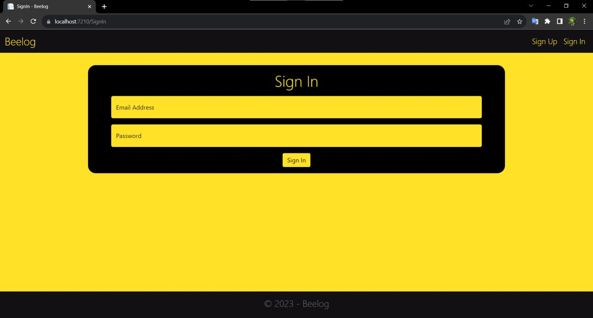

### Sign Up Form

New users can create an account using the Sign Up page. The form collects the user's name, email, and password. Additionally, the user's profile picture can be uploaded during the sign-up process.
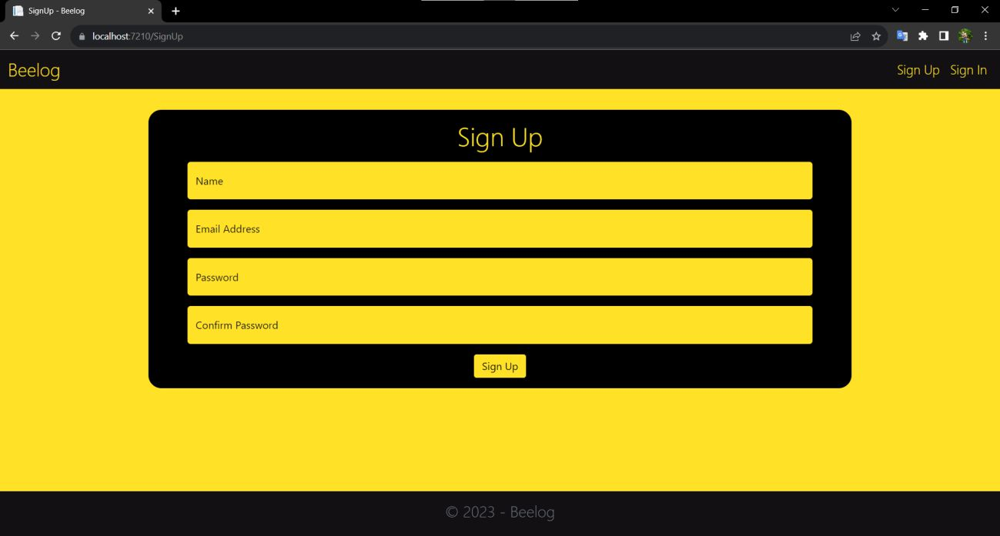

### Password Matching Feature

Both the Sign In and Sign Up forms ensure that the entered passwords match by displaying a password mismatch message if the passwords do not match.
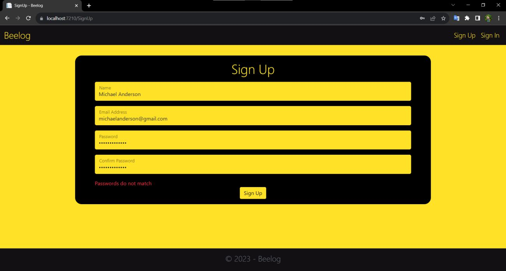

## Home Page 

### Add a Post

The home page features a text area where users can write and post updates. Users can express their thoughts, ideas, or share content with others.
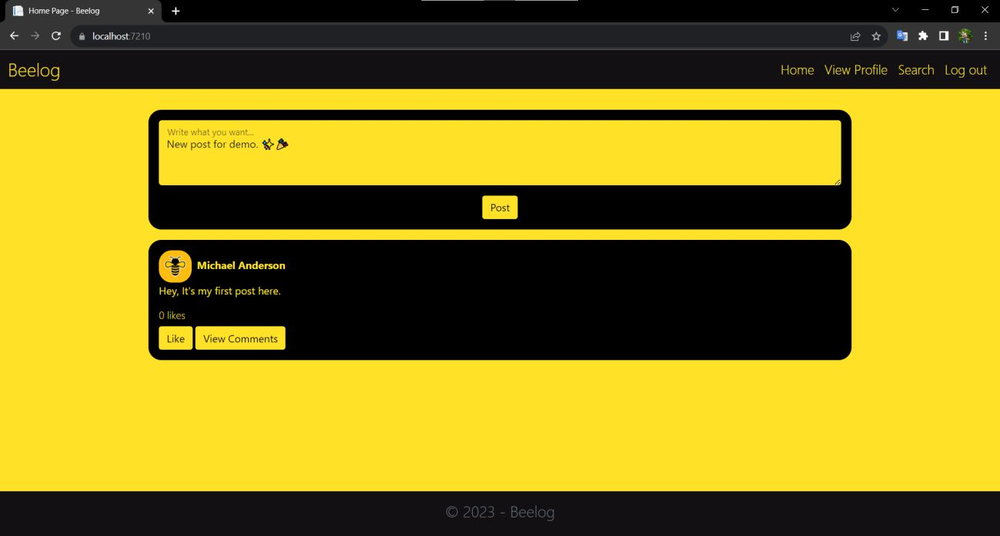

### Display Posts

The home page displays posts from different users. Each post includes the user's profile picture, username, and the post content.
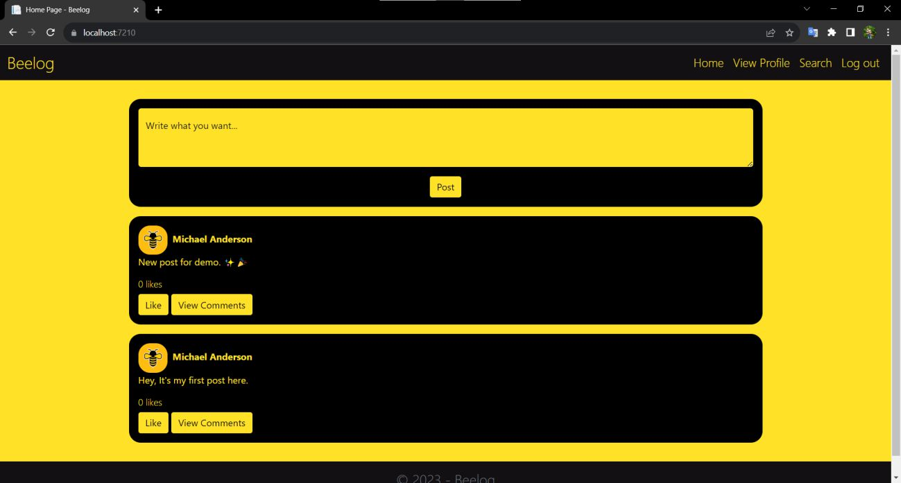

If the user doesn’t follow anyone, BeeLog ‘ll suggest users to follow.
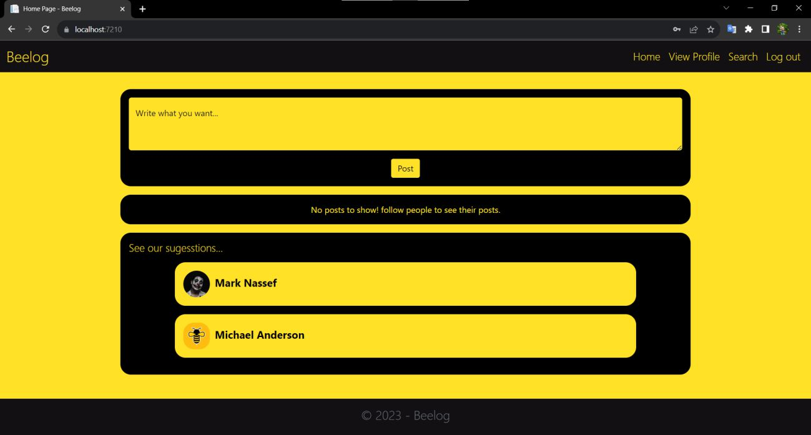

### Like and Unlike Posts

Users can like or unlike posts by clicking the "Like" and "Unlike" buttons. The like count for each post updates in real-time.
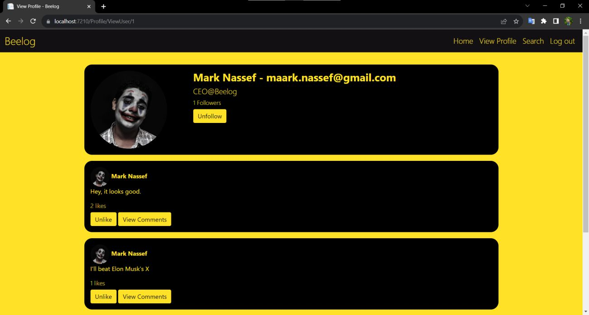

### View Comments

Users can view comments on each post by clicking the "View Comments" button. A modal window opens, displaying comments for the respective post.
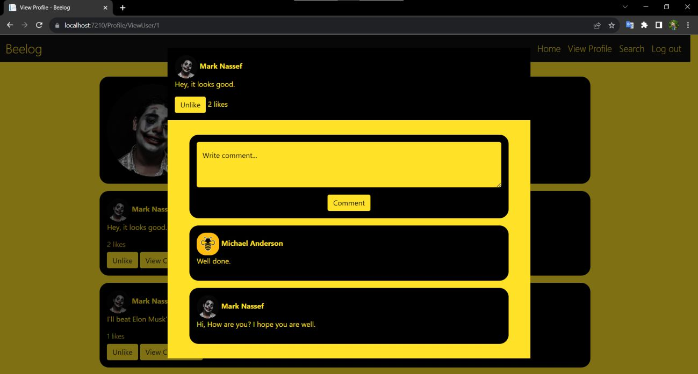

## Profile Page 

### View Profile Information

Users can view their own or other users' profiles. The profile page displays the user's profile picture, name, email, and bio.
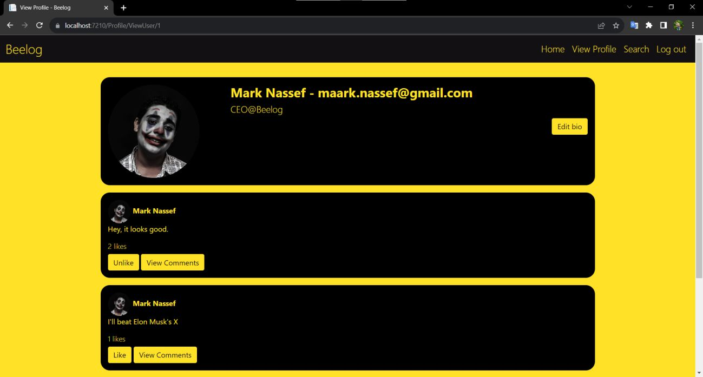

### Profile Picture Management

Users can upload or change their profile picture by clicking the "Upload Profile Picture" button. This opens a modal window where users can select an image to upload.
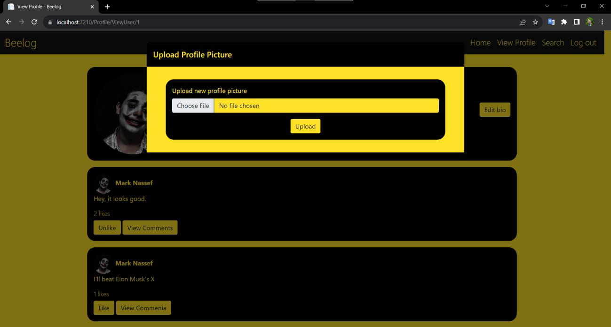

### Edit Bio

Users with edit profile permissions can modify their bio. Clicking the "Edit bio" button opens a modal window where users can update their bio information.
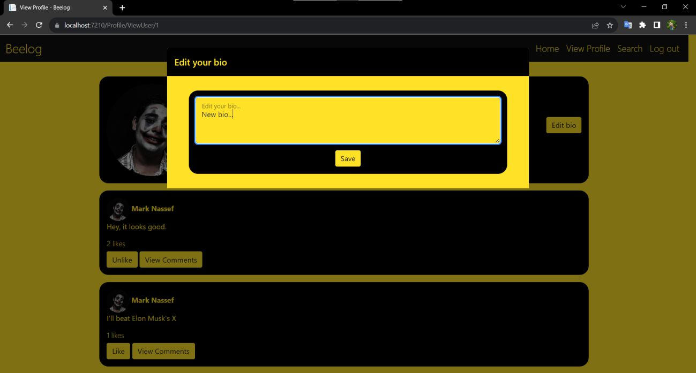

### Follow and Unfollow Users

Users can follow or unfollow other users by clicking the respective buttons on the profile page. The page dynamically updates to show the current follower count.
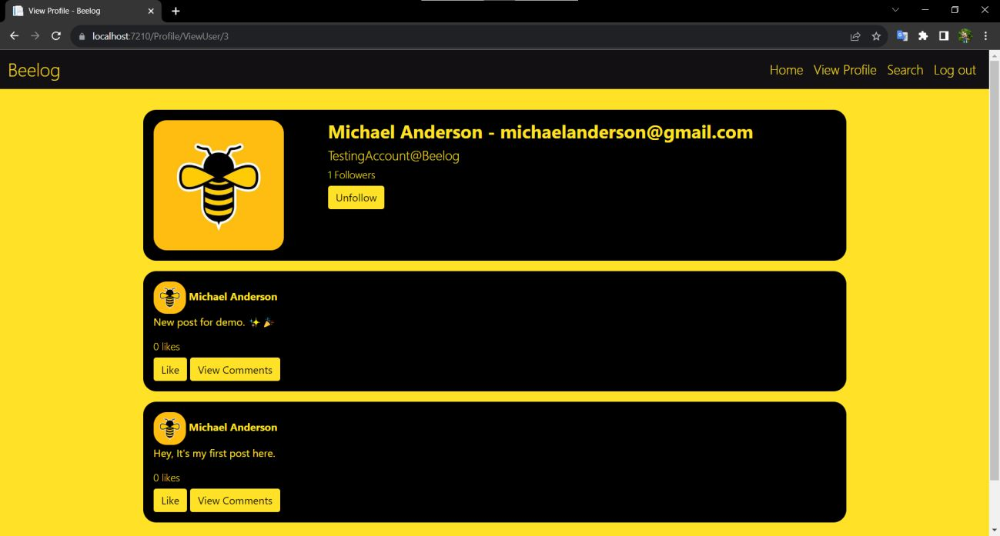

## Search Users 

### Search Input Field

The search feature allows users to find other users by entering a name in the search box. As users type, the application suggests similar names.

### Display Similar Names

After entering a search query, the application displays a list of users with names that closely match the search term.

### Direct Profile Links

Each displayed user's name is a clickable link that takes users to the respective profile page.

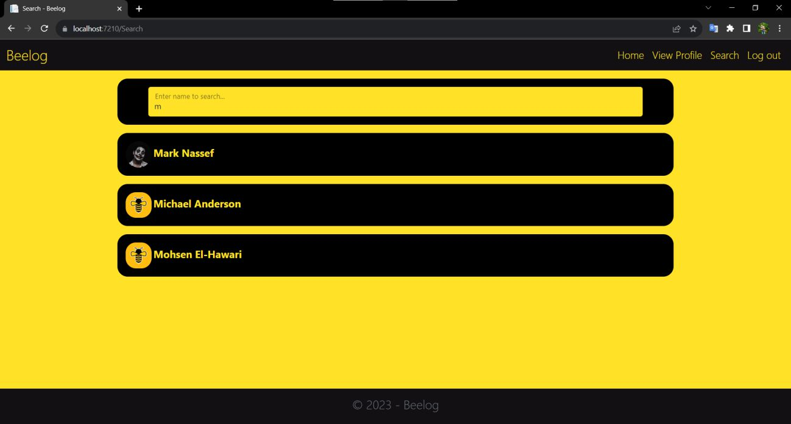

## Tech Stack 

1. ASP.NET MVC
2. SQL Server
3. jQuery
4. Bootstrap

## Usage 

1. Sign up for a BeeLog account or log in if you already have an account.
2. Explore the home page to view posts from other users.
3. Like posts, view comments, and interact with other users.
4. Navigate to your profile page to manage your profile and posts.

## Contributing 

Contributions to BeeLog are welcome! If you find any issues or have suggestions for improvements, feel free to submit a pull request.

## License 

This project is licensed under the [MIT License](LICENSE).
